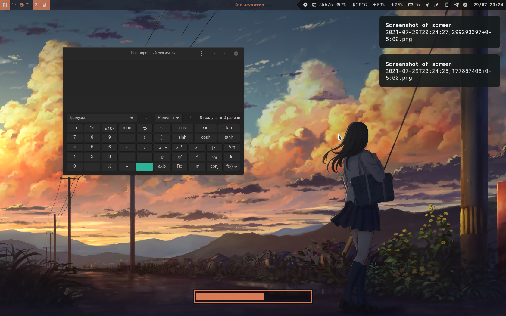
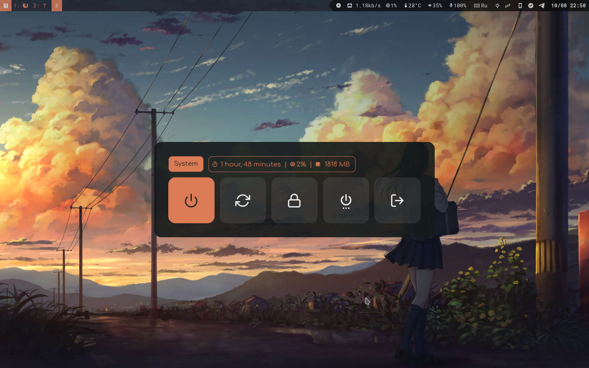
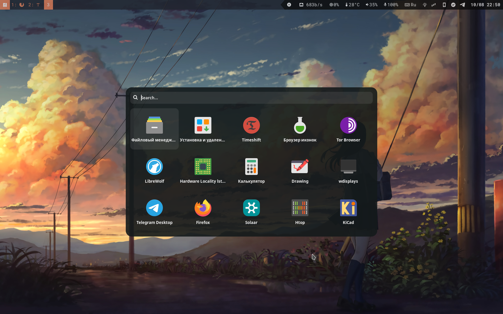
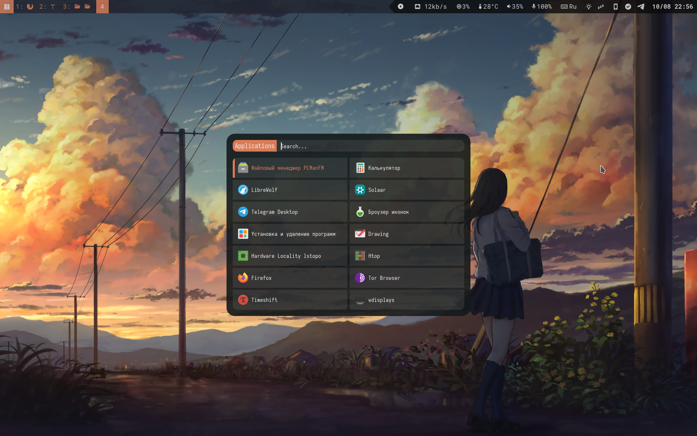
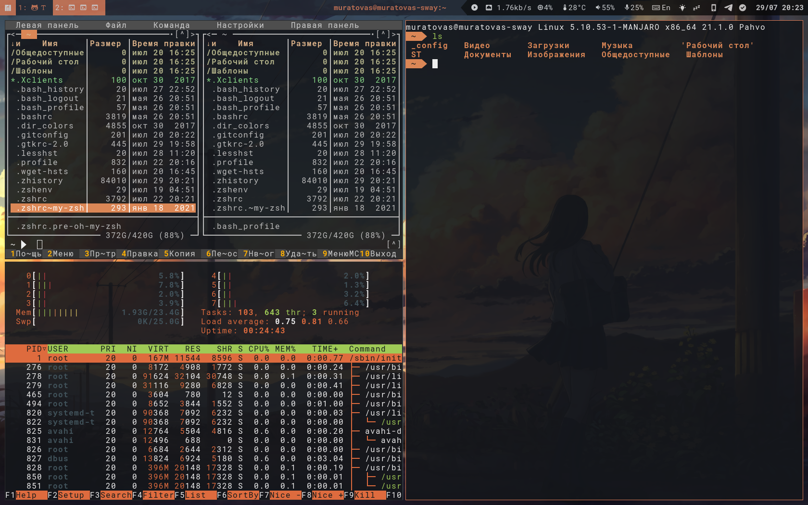
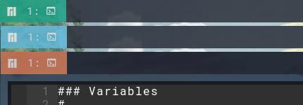
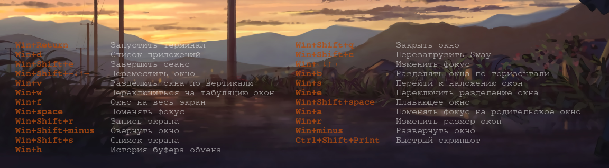
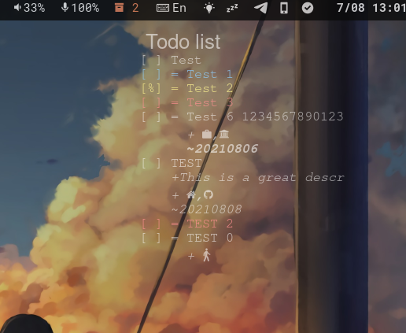
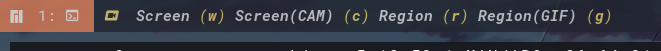
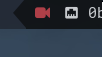

# Dotfiles

Мой набор конфигураций рабочей среды построенный на **sway**. За основу взят дистрибутив **[manjaro-sway](https://github.com/Manjaro-Sway/manjaro-sway)**. 
Несмотря на это интерфейс и структура конфигурации переработана. Устранены недоработки, добавлены новые возможности. 

Дополнительные изображения 

### Отличительные особенности

1. Система стилей, цветовых гамм

    Для компонентов использованных в конфигурации, предусмотрена система изменения глобальной цветовой гаммы. Осуществляется это по средствам так называемых “themes”, располагающихся в `sway/themes`. Уже реализованы “голубая, оранжевая, зеленая” тема, выбор цветов обусловлен темами gtk.

     

2. Виджет рабочего стола с подсказкой горячих клавиш 

    Данная подсказка выводится по средствам nwg-wrapper. Список клавиш формируется автоматически, напрямую из файлов конфигурации sway.

    
    
3. Виджет Todo

    Очень полезное дополнение, позволяет отображать заметки на рабочем столе в текстовой форме. Для работы требует vdirsyncer, он для синхронизации календарей по средствам протокола caldav. Например из вашего nextcloud.

    

4. Переработанная система записи с экрана

    Предусмотрена  запись экрана так и области экрана. Результат можно сохранить в **GIF**, **MP4**.

    Хотелось бы выделить возможность создать виртуальную **веб камеру** (в конце мини инструкция), в которую будет передаваться видео поток экрана. Это особенно актуально для показа экрана в приложениях не поддерживающих такую функцию, например **Telegram**. 
    При захвате экран в панели появляется значок красной камеры.

     

5. Реализован “ночной режим” 

    В соответствие с расписанием включается фильтр синего цвета, с плавным изменением температуры. Настройка осуществляется через файле настроек `.config/wlsunset/config`.  Так же реализован модуль для waybar, позволяющий включать и отключать фильтр. Его можно найти по значку “ ﯦ ”

6. Модуль контроля мультимедиа. 

    На основе `playerctl` реализован модуль для waybar, позволяющий управлять мультимедиа практически из любого плеер, в том числе браузера.

### Немного о составляющих

Основные компоненты:

универсальное меню

- [waybar](https://github.com/Alexays/Waybar) (панель)
- [rofi](https://github.com/lbonn/rofi) **1.7.0** (универсальное меню)
- [mako](https://github.com/emersion/mako) (уведомления)
- [swaylock](https://github.com/mortie/swaylock-effects) (экран блокировки)
- [wob](https://github.com/francma/wob) (Overlay Bar)
- [grim](https://github.com/emersion/grim) (снимок экрана)
- [wf-recorder](https://github.com/ammen99/wf-recorder) (запись экрана)
- [wlsunset](https://sr.ht/~kennylevinsen/wlsunset/) (ночной режим)
- [playerctl](https://github.com/altdesktop/playerctl) (управление мультимедиа)
- [wlogout](https://github.com/ArtsyMacaw/wlogout) (DELETED) (меню выхода из системы)
- [wofi](https://github.com/tsujp/wofi) (DELETED) (меню приложений)

Вспомогательные модули:
- [flashfocus](https://github.com/fennerm/flashfocus) (анимация фокуса на окне)
- [sworkstyle](https://github.com/Lyr-7D1h/swayest_workstyle) (визуализирует запущенные приложения)
- [sway-xkb-switcher](https://github.com/nmukhachev/sway-xkb-switcher) (запоминает раскладку клавиатуры приложения)
- [autotiling](https://github.com/nwg-piotr/autotiling) (позволяет автоматизировать разделение экрана)
- [nwg-wrapper](https://github.com/nwg-piotr/nwg-wrapper) (виджеты рабочего стола)

Многое другое ……

Система:
- [sway](https://github.com/swaywm/sway)
- [kitty](https://github.com/kovidgoyal/kitty)
- [zsh](https://www.zsh.org/)
- [wl-clipboard](https://github.com/bugaevc/wl-clipboard) (буфер обмена)

Дополнительные приложения:
- [mc](https://github.com/MidnightCommander/mc) (файловый менеджер)
- [micro](https://github.com/zyedidia/micro) (текстовый редактор)
- [vdirsyncer](https://github.com/pimutils/vdirsyncer) (программа для синхронизации заметок и календарей по средствам протокола CalDav)
- [clipman](https://github.com/yory8/clipman) (менеджер буфера обмена)

### Установка

Как таковая установка не предусмотрена. Требуется ручное развертывание, обусловлено уникальностью каждой системы.
Материалы изложенный в этом репозитории позиционируются как пример, для собственных конфигураций. 
НО, вы можете переместить все файлы в `~/.config`, и установить все необходимые вышеперечисленные зависимости. 

### Запуск virtual cam

Необходимо установить пакеты:

~~~bas
v4l2loopback
linux510-headers
~~~

В файл `/etc/modules-load.d/v4l2loopback.conf`  вписать строку, это позволит производить автоматический запуск камеру:

~~~bas
v4l2loopback
~~~

В файл `/etc/modprobe.d/v4l2loopback.conf`  прописать конфигурацию

~~~bash
options v4l2loopback devices=1
options v4l2loopback video_nr=10
options v4l2loopback card_label="Virtual cam - screencast" 
options v4l2loopback exclusive_caps=1
~~~

### Источники

Конфигурации rofi основаны на примерах из репозитория: https://github.com/adi1090x/rofi

