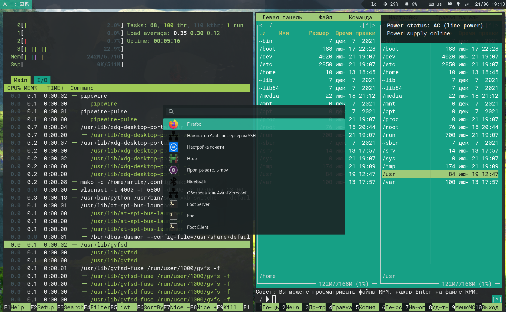

# Dotfiles
В этом репозитории вы найдете мой набор конфигураций `dwl` и `artix`. 
Базируется на системе из ветки [artix](https://github.com/MuratovAS/dotfiles/tree/artix). В будущем планирую переезд на `runit`.

Чем `dwl` лучше `sway`? Ответ прост, количество зависимостей, меньше расход ресурсов, простое внесение изменений в конфигурацию.
Изначально планировал использовать `dwl` для виртуальных машин, но в последствии оказалось что он весьма стабилен для повседневного использования.



## Каких результатов получилось достичь

Несколько раз подумайте, зачем вам это ;) Это будет долгий путь.

Итого:
- Получилось достичь схожего с `sway` поведения работы.
- Адекватная работа с двумя мониторами
- Избавиться от мыла на HIDPI
- Реализован статусбар
- Реализован достаточно простой tray
- Реализована строка уведомлений
- Единый стиль для `QT` и `GTK` приложений


Что не сделано:
- Избавиться от `mako` (он по-прежнему необходим, как заглушка)
- Единый конфигурационный файл всей графической системы
- Плавающие окно иногда появляются в неожиданных местах.
- Экран блокировки (а он вообще нужен???)
- В меню запуска приложений присутствуют приложения которые не открываются, а так же неудобный поиск.

## С чего начать

Я подготовил что то вроде временного окружения для тестирования данной сборки. 
Компоненты имеющие патчи имеют собственные репозитории в моем профиле. Скачиваются после волнения `make clone`.

Команды для развертывания:
```
git clone https://github.com/MuratovAS/dotfiles.git
cd dotfiles
git checkout artix-dwl 
make clone
make clean; make
make run
```