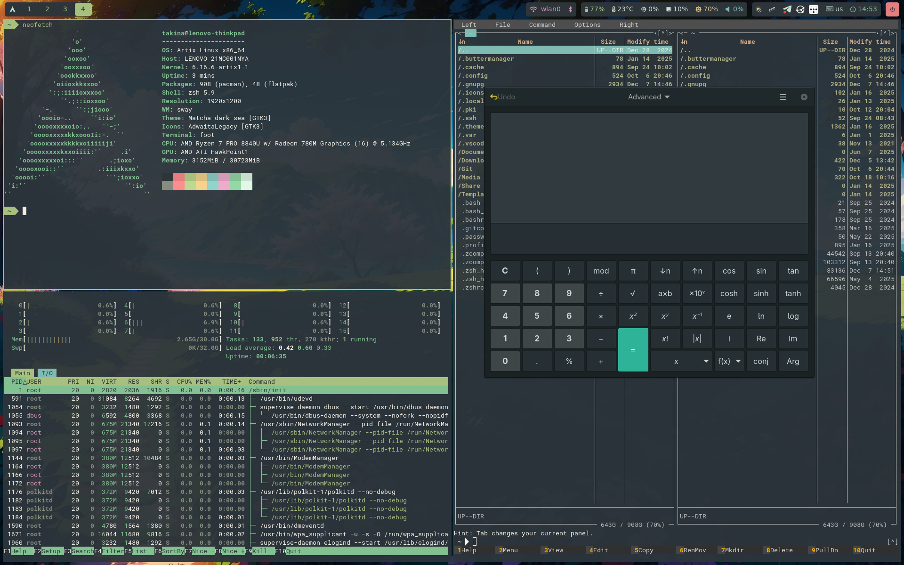

# Dotfiles

В этом репозитории вы найдете мой набор конфигураций `dwl` и `artix (dinit)`. Скорее это все одна большая инструкция по сборки системы, подобной моей.
Все необходимые компоненты вы найдете в файлах или в соответствующих репозиториях в моем профиле.

Основные положения:

- Минималистичная система (меньше компонентов = меньше звеньев отказа)
- Простое администрирование (`dinit`, `btrfs`)
- Нейтральный, единообразный дизайн/стиль
- Атомарность приложений (все пользовательские приложения в `flatpak`)
- LUKS



# Установка Artix

Для установки системы нам потребуется USB накопитель с предварительно записанным artix linux. 

После загрузки с USB откроем терминал и перейдем под ROOT

```bash
sudo su
```

## Разметка диска

В первую очередь необходимо создать разметку ФС (в нашем случае `GPT`).
Установку системы будем производить на `ssd`, в качестве корневой системы используем `btrfs`.
Ориентировочная структура разделов:

```text
0. efi    = 512M
1. lvm    = lvm (luks)
2. free   = 1-5% disk size
```

Для создания разметки воспользуемся командой

```bash
cfdisk /dev/nvme0n1
```

Форматируем разделы, создаем файл подкачки

```bash
cryptsetup --verbose --type luks1 --cipher aes-xts-plain64 --key-size 256 --hash sha256 --iter-time 1000 --use-random --verify-passphrase luksFormat /dev/nvme0n1p2

# Are you sure? (Type 'yes' in capital letters): YES
# Key slot 0 created.

cryptsetup luksOpen /dev/nvme0n1p2 lvm-system
# vgdisplay
vgcreate lvmSystem /dev/mapper/lvm-system
lvcreate --contiguous y --size 64G lvmSystem --name volSwap
lvcreate --contiguous y --extents +100%FREE lvmSystem --name volRoot
# lvdisplay

mkfs.fat -n ESP -F 32 /dev/nvme0n1p1
# OR mkfs.vfat /dev/nvme0n1p1

mkswap -L SWAP /dev/lvmSystem/volSwap > tmp.txt
# OR mkswap /dev/sda3 -L "swap" 

mkfs.btrfs /dev/lvmSystem/volRoot
mount /dev/lvmSystem/volRoot /mnt
cd /mnt
btrfs subvolume create _active
btrfs subvolume create _active/rootvol
btrfs subvolume create _active/homevol
btrfs subvolume create _active/docker
btrfs subvolume create _active/libvirt
btrfs subvolume create _active/data
btrfs subvolume create _active/log
btrfs subvolume create _snapshots
```

Монтируем рабочие разделы

```bash
cd /home/artix
umount /mnt

swapon /dev/lvmSystem/volSwap
mount -o subvol=_active/rootvol /dev/lvmSystem/volRoot /mnt
mkdir /mnt/{home,boot,var}
mkdir /mnt/media
mkdir /mnt/media/data
mkdir /mnt/boot/efi
mkdir /mnt/var/log
mkdir /mnt/var/lib/docker
mkdir /mnt/var/lib/libvirt
mkdir /mnt/media/data
mkdir /mnt/mnt/defvol

mount /dev/nvme0n1p1 /mnt/boot/efi
mount -o subvol=_active/data /dev/lvmSystem/volRoot /mnt/media/data
mount -o subvol=_active/docker /dev/lvmSystem/volRoot /mnt/var/lib/docker
mount -o subvol=_active/log /dev/lvmSystem/volRoot /mnt/var/log
mount -o subvol=_active/libvirt /dev/lvmSystem/volRoot /mnt/var/lib/libvirt
mount -o subvol=_active/homevol /dev/lvmSystem/volRoot /mnt/home
mount -o subvol=/ /dev/lvmSystem/volRoot /mnt/mnt/defvol
```

## Установка базовой системы

В качестве системы используем `dinit`.
В качестве системы управления сеансами будет использоваться `elogind`, можно заменить его на `seatd`. Стоит отметить `seatd` не поддерживает `polkit`, это может стать серьезной проблемой при запуске GUI приложений требующих привилегированного доступа. В таком случае придется запускать GUI приложения от `root`, что не безопасно и неудобно.
В зависимости от архитектуры целевой машины выберите `ucode`.

```bash
basestrap /mnt base base-devel dinit 
basestrap /mnt elogind-dinit polkit  polkit-qt5 polkit-gnome
# OR seatd-dinit #NOT support polkit

basestrap /mnt btrfs-progs linux linux-headers linux-firmware

basestrap /mnt amd-ucode iucode-tool
# OR basestrap /mnt intel-ucode iucode-tool

basestrap /mnt vulkan-radeon radeontop
```

Создание файла с информацией о разделах

```bash
fstabgen -U /mnt >> /mnt/etc/fstab
```

## Настройка базовой системы

Перейдем в корневой каталог будущей нашей системы

```bash
artix-chroot /mnt
```

Конфигурация часового пояса.
В данном примере `hwclock` позволит установить время по аппаратным часам

```bash
ln -sf /usr/share/zoneinfo/Asia/ГОРОД /etc/timezone
hwclock --systohc
```

Установим базовое ПО (необязательно)

```bash
pacman -S vi nano htop wget
```

Установим пакеты для управления сетевым соединением

```bash
pacman -S dhcpcd dhclient networkmanager networkmanager-dinit
dinitctl enable NetworkManager
```

Настройка языковых пакетов

```bash
sed '/en_US\.UTF-8/s/^#//' -i /etc/locale.gen
sed '/ru_RU\.UTF-8/s/^#//' -i /etc/locale.gen

#echo "LANG=ru_RU.UTF-8" > /etc/locale.conf

locale-gen
```

Определение сетевого имени машины

```bash
echo "ИМЯХОСТА" > /etc/hostname
echo "127.0.0.1 localhost" > /etc/hosts
echo "::1       localhost" >> /etc/hosts
# echo "127.0.1.1 ИМЯХОСТА.localdomine ИМЯХОСТА" >> /etc/hosts
```

## Настройка репозиториев

Установим поддержку `ArchLinux` репозиториев и AUR.

```bash
pacman -S artix-archlinux-support
```

Пропишешь в конфигурации `pacman` новые репозитории. Добавить в `/etc/pacman.conf`

```bash
# Arch
[extra]
Include = /etc/pacman.d/mirrorlist-arch

[community]
Include = /etc/pacman.d/mirrorlist-arch

[multilib]
Include = /etc/pacman.d/mirrorlist-arch
```

Обновим репозитории

```bash
# pacman -Sy archlinux-keyring artix-keyring
# rm -r /etc/pacman.d/gnupg
# pacman-key --init

pacman-key --populate archlinux artix
pacman -Scc
pacman -Syyu
```

Так же данными командами можно исправить ошибку `Invalid or corrupted packages (PGP signature)`

## AUR

```
sudo pacman -S go
wget https://aur.archlinux.org/cgit/aur.git/snapshot/yay.tar.gz
tar -xvf yay.tar.gz
cd yay
makepkg -i
```

## 

TODO:

```
pacman -S device-mapper-dinit lvm2-dinit cryptsetup-dinit
```

## Установка загрузчика

за hibernation отвечает `resume`

### GRUB

```bash
pacman -S device-mapper-dinit lvm2-dinit cryptsetup-dinit
pacman -S lvm2 cryptsetup glibc mkinitcpio
pacman -S openssl openssl-1.1

dinitctl enable dmeventd
dinitctl enable lvm2
dinitctl enable cryptsetup
```

Добавим `HOOK` в `/etc/mkinitcpio.conf`
```bash
HOOKS=( ......... encrypt, lvm2, resume)
```

```bash
mkinitcpio -p linux
```

```bash
pacman -S grub os-prober efibootmgr grub-btrf

blkid -s UUID -o value /dev/nvme0n1p1
```

Редактируем `/etc/default/grub`
```bash
# GRUB_CMDLINE_LINUX_DEFAULT
# GRUB_CMDLINE_LINUX_DEFAULT="cryptdevice=UUID=ИЗ_blkid:lvm-system loglevel=3 quiet resume=UUID=ИЗ_FSTAB_SWAP"

GRUB_ENABLE_CRYPTODISK="y"
GRUB_COLOR_NORMAL="yellow/black"
GRUB_COLOR_HIGHLIGHT="black/yellow"
```

```bash
grub-mkconfig -o /boot/grub/grub.cfg
grub-install --target=x86_64-efi --efi-directory=/boot/efi --bootloader-id=artix --removable --recheck /dev/nvme0n1
```

## Настройка пользователя

Не забываем задать пароль `root`

```bash
passwd
```

Создаем пользователя

```bash
useradd -m -G wheel -s /bin/bash ИМЯ
passwd ИМЯ
```

Отключаем пароль sudo для `wheel`. А так же отключи запрос пароля для `poweroff` это позволит управлять питанием из WM

```bash
sed '/%wheel ALL=(ALL:ALL) ALL/s/^#//' -i /etc/sudoers
#echo -e '## Same thing without a password\n \
%wheel ALL=(ALL:ALL) NOPASSWD: /usr/bin/poweroff\n \
%wheel ALL=(ALL:ALL) NOPASSWD: /usr/bin/reboot\n \
' >> /etc/sudoers
```

## Завершение установки базового образа

На данном этапе можно считать установку оконченной. Далее завершаем работу, перезагружаемся в установленную систему.

```bash
exit
umount -R /mnt
reboot
```

## Избежание необходимости дважды вводить парольную фразу (LUKS)

```bash
mkdir -m 700 /etc/cryptsetup-keys.d
dd bs=512 count=4 if=/dev/random of=/etc/cryptsetup-keys.d/cryptlvm.key iflag=fullblock
chmod 600 /etc/cryptsetup-keys.d/cryptlvm.key
cryptsetup -v luksAddKey /dev/sda3 /etc/cryptsetup-keys.d/cryptlvm.key
```

Добавим в `/etc/mkinitcpio.conf`
```
FILES=(/etc/cryptsetup-keys.d/cryptlvm.key)
```

Добавим в  `/etc/default/grub`

```
GRUB_CMDLINE_LINUX="... cryptkey=rootfs:/etc/cryptsetup-keys.d/cryptlvm.key"
```

Обновим `GRUB` и `ramfs`
```
mkinitcpio -p linux
grub-install --target=x86_64-efi --efi-directory=/boot/efi --bootloader-id=artix --removable --recheck /dev/nvme0n1
grub-mkconfig -o /boot/grub/grub.cfg
```

## Подготовка рабочего окружения

Запустим сервис обеспечивающий авторизацию в системе

```bash
#elogind
dinitctl enable elogind
dinitctl start elogind
usermod -aG video ИМЯ

#seatd
#dinitctl enable seatd
#dinitctl start seatd
#usermod -aG seat ИМЯ
```

Пропишем в системный `enviroment` выбранный в прошлом пункте LM

```bash
echo "LIBSEAT_BACKEND=logind" >> /etc/environment
```

Добавим возможность использовать `.profile` для пользовательских `env`. А так же возможность добавлять пользовательские бинарные приложения.

```bash
echo 'export PATH="$HOME/.local/bin:$PATH"' > /etc/profile.d/home-local-bin.sh
echo -e '# Load profile from home\n[[ -f $HOME/.profile ]] && . $HOME/.profile' >> /etc/profile
```

## Установка WM

Установим `dwm` и терминал `foot`
Стоит отметить что `jq` используется в некоторых скриптах WM, по этой причине он внесет список необходимых.

```bash
sudo pacman -S foot mako wl-clipboard jq
```

Для функционирования и настройки WM нам потребуются

```bash
sudo pacman -S git pkg-config
sudo pacman -S libinput wayland wlroots wayland-protocols libxkbcommon fcft pixman tllist
yay -S wbg
```

## Поддержка xwayland

Если вам требуется поддержка `xorg` приложений. Удалить ее будет невозможно!

```bash
sudo pacman -S xorg-xwayland
```

Далее необходимо произвести распаковку ваших или моих `dotfiles` в домашнюю папку пользователя.

```bash
git clone https://github.com/MuratovAS/dotfiles.git
cp -r dotfiles/.* ~/ && rm -rf ~/.git ~/design
cd ~/.local/src
```

## ZSH как альтернатива BASH

Установка `zsh`

```bash
sudo pacman -Syu zsh
chsh -s $(which zsh)
```

Настройка `zsh` (выполнять не требуется, если скопировали мой dotfiles)

```bash
mv ~/.oh-my-zsh ~/.config/oh-my-zsh
sed -i 's@\.oh-my-zsh@\.config/oh-my-zsh@g' ~/.zshrc
sed -i 's@plugins=(git)@plugins=(git zsh-autosuggestions zsh-syntax-highlighting)@g' ~/.zshrc
sed -i 's@robbyrussell@agnoster@g' ~/.zshrc
sed -i '/mode disabled/s/^#//' ~/.zshrc
sed -i '/ prompt_context/s/^/#\ /' ~/.config/oh-my-zsh/themes/agnoster.zsh-theme
```

```bash
sh -c "$(curl -fsSL https://raw.github.com/ohmyzsh/ohmyzsh/master/tools/install.sh)"
git clone https://github.com/zsh-users/zsh-syntax-highlighting.git ${ZSH_CUSTOM:-.config/oh-my-zsh/custom}/plugins/zsh-syntax-highlighting
git clone https://github.com/zsh-users/zsh-autosuggestions ${ZSH_CUSTOM:-.config/oh-my-zsh/custom}/plugins/zsh-autosuggestions
```

## XDG

Установим утилиты `xdg`, это позволит обеспечить ассоциацию файлов и добавить поддержку ярлыков. Пакет `xdg-user-dirs` необходим некоторым приложениям для доступа к стандартным каталогом. От него можно отказаться, вручную создав каталоги.

```bash
sudo pacman -S xdg-utils xdg-user-dirs
#mkdir ~/Share ~/Download ~/Documents ~/Media ~/Templates
#xdg-user-dirs-update --set DESKTOP ~/Media
#xdg-user-dirs-update --set DOCUMENTS ~/Documents
#xdg-user-dirs-update --set DOWNLOAD ~/Download
#xdg-user-dirs-update --set MUSIC ~/Media
#xdg-user-dirs-update --set PICTURES ~/Media
#xdg-user-dirs-update --set PUBLICSHARE ~/Share
#xdg-user-dirs-update --set TEMPLATES ~/Templates
#xdg-user-dirs-update --set VIDEOS ~/Media
```

## Установка pipewire

Установим `pipewire` с базовыми дополнениями и TUI менеджер `pulsemixer`

```bash
sudo pacman -S pipewire-alsa pipewire pipewire-jack pipewire-pulse pipewire-media-session pamixer pulsemixer
```

## Поддержка screancast и диалоговых окон

```bash
sudo pacman -S xdg-desktop-portal xdg-desktop-portal-wlr xdg-desktop-portal-gtk
mkdir .config/xdg-desktop-portal/
cp /usr/share/xdg-desktop-portal/gtk-portals.conf .config/xdg-desktop-portal/portals.conf
```

## Шрифты

```bash
sudo pacman -S wqy-microhei ttf-dejavu ttf-roboto ttf-roboto-mono #system
sudo pacman -S ttf-carlito ttf-caladea ttf-liberation #base text
sudo pacman -S ttf-nerd-fonts-symbols #icon
sudo pacman -S ttf-font-awesome #emoji
```

Обновление кэша шрифтов

```bash
fc-cache -f -v
#fc-list
```

## Синхронизация времени и даты

Установка `chrony`, позволит синхронизировать время с NTP сервером

```bash
sudo pacman -S chrony chrony-dinit
sudo dinitctl enable chrony
```

## Поддержка `appimage`

По моим предположениям AppImage должен работать из коробки, но встречаются случаи когда приложение не запускается. У меня решилась проблема установкой недостающих компонентов `fuse`.

```bash
sudo pacman -S fuse-common fuse3 fuse2
```

## Все что может пригодиться на ноутбуке

```bash
sudo pacman -S tlp tlp-dinit   # менеджер питания
sudo dinitctl enable tlp
#yay -S tlpui

yay -S poweralertd              # Уведомляет о состоянии питания

sudo pacman -S bluez bluez-utils bluez-dinit
sudo yay -S bluetuith-bin  # TUI bluetooth
sudo usermod -aG rfkill ИМЯ
sudo usermod -aG lp ИМЯ
sudo dinitctl enable bluetoothd

yay -S light            # Управляет подсветкой
```

### Дополнительные пакеты

Данные пакеты используются в текущей конфигурации `dwl`, но установка не обязательна

```bash
sudo pacman -S playerctl                        # Управление медиа плиром из waybar
sudo pacman -S wf-recorder
sudo pacman -S slurp grim swappy    # Инструменты для снимков экрана
sudo pacman -S wlsunset                                 # Ночный режим, фильтр синего цвета
sudo pacman -S khal                             # Календарь
sudo pacman -S gnome-keyring                    # Систума управления ключами (необходима для многих приложений)
khal configure
```

## Поддержка `flatpak`

```bash
sudo pacman -S flatpak flatpak-builder
flatpak install flathub com.github.tchx84.Flatseal
```

## Оформление `GTK`

```bash
sudo pacman -S xcursor-breeze
yay -S matcha-gtk-theme
```

## Оформление `electron`

Большинство приложений по умолчанию работают через `xwayland`, что не очень правильно. Так же это ограничивает разрешения изображения, и на HiDPI мониторе будет выглядеть печально. Данную проблему можно исправить файлом конфигурации, принудительно запускающий `wayland` версию приложения. В некоторых случаях требуется вручную создать файл для вашей версии `electron`.

```bash
ln -s ~/.config/electron-flags.conf ~/.config/electron12-flags.conf
ln -s ~/.config/electron-flags.conf ~/.config/electron13-flags.conf
ln -s ~/.config/electron-flags.conf ~/.config/electron18-flags.conf
```

## Вход в систему без пароля

```bash
cp /etc/dinit.d/config/agetty-default.conf /etc/dinit.d/config/agetty-tty1.conf
```

Содержание `/etc/dinit.d/config/agetty-tty1.conf`
```bash
 # DO NOT REMOVE THIS FILE!
 # Note: You can copy and rename this file to the name of the tty you
 #     want (e.g.: /etc/dinit.d/config/agetty-tty1.conf will make a
 #     configuration specific to tty1)
 GETTY_BAUD=38400
 GETTY_TERM=linux
 GETTY_ARGS="-J -a ИМЯ"
```

## Disconnect CPU Boost AMD

Содержание `/etc/dinit.d/legion`
```
type          = scripted
command       = /bin/sh -c "echo 'passive' > /sys/devices/system/cpu/amd_pstate/status; echo 0 > /sys/devices/system/cpu/cpufreq/boost;"
start-timeout = 5
before        = tty1.target
```

```bash
cd /etc/dinit.d/boot.d/
sudo ln -s  ../legion legion
sudo dinitctl enable legion 
```

## Немного о ПО

Полезные GUI приложения

```bash
sudo pacman -S pamac
sudo pacman -S seahorse
sudo pacman -S gnome-disk-utility
sudo pacman -S nautilus
sudo pacman -S file-roller

yay -S buttermanager

yay -S gnome-calculator-gtk3
sudo pacman -S librewolf 
```

Полезные TUI приложения

```bash
sudo pacman -S micro mc fzf neofetch
sudo pacman -S bat glow chafa
sudo pacman -S pass cmus
sudo pacman -S netcat
```

Набор приложений для просмотра медиа файлов

```bash
sudo pacman -S mpv imv zathura
sudo pacman -S zathura-pdf-poppler zathura-djvu
sudo pacman -S ffmpeg ffmpegthumbnailer
#sudo pacman -S f3d
```

Расширение поддержки устройств и форматов файлов

```bash
sudo pacman -S exfat-utils
yay -S ntfsprogs-ntfs3
sudo pacman -S p7zip unrar
sudo pacman -S gvfs-mtp
```

Пользовательские приложения

```bash
flatpak install flathub org.gnome.Evolution
flatpak install flathub org.gnome.Evince
flatpak install flathub org.libreoffice.LibreOffice
flatpak install flathub com.github.marktext.marktext
flatpak install flathub com.jgraph.drawio.desktop
flatpak install flathub io.github.f3d_app.f3d
flatpak install flathub org.telegram.desktop
flatpak install flathub com.jeffser.Alpaca
flatpak install flathub com.github.Murmele.Gittyup
flatpak install flathub io.github.flattool.Warehouse

sudo pacman -S kdeconnect
sudo pacman -S tailscale
sudo pacman -S tailscale-dinit 
sudo dinitctl enable tailscaled
yay -S trayscale
```

## Установка `docker`
```bash
sudo pacman -S docker docker-compose docker-dinit
sudo dinitctl start dockerd
sudo usermod -aG docker $USER
yay -S lazydocker
```

## Установка `kvm/qemu`
```
sudo pacman -S dmidecode virt-manager virt-viewer qemu edk2-ovmf vde2 dnsmasq bridge-utils libvirt-dinit #qemu-full
sudo usermod -a -G libvirt $(whoami)
sudo chown -R libvirt-qemu:libvirt-qemu /var/lib/libvirt 
```

## Костыль для тем в `flatpak`

```bash
cp -r /usr/share/themes/ .themes/
cp -r /usr/share/icons/ .icons/ 
flatpak install flathub org.gtk.Gtk3theme.Breeze  
```

Так же следует добавить `env` для всех `flatpak` приложений
```
GTK_THEME=Matcha-dark-sea
ICON_THEME=AdwaitaLegacy
```

Подробнее:
[Flatpak documentation they are blacklisted](https://docs.flatpak.org/en/latest/sandbox-permissions.html?ref=itsfoss.com#filesystem-access).
[Apply GTK System Themes on Flatpak Apps in Linux](https://itsfoss.com/flatpak-app-apply-theme/)

Credit:
https://www.thegeekstuff.com/2016/03/cryptsetup-lukskey/
https://habr.com/ru/articles/716308/